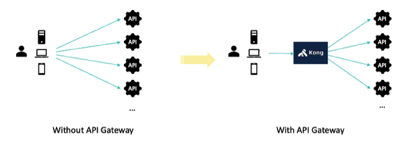
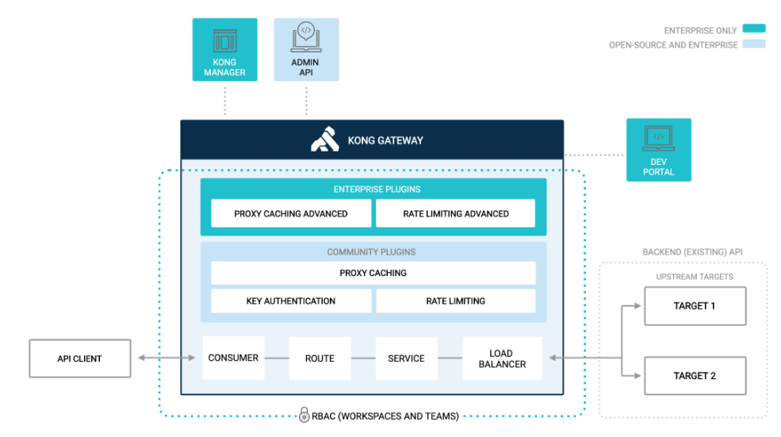

# API Gateway là gì?
- Một hệ thống Microservices trung bình sẽ có một vài cho tới hàng trăm services khác nhau, nếu như client giao tiếp trực tiếp với các service này thì sơ đồ kết nối sẽ cực kỳ khó quản lý. Việc này sẽ dấn tới một số rắc rối với client:
  - Phần code phía client sẽ trở nên phức tạp hơn vì phải tracking nhiều endpoint
  - Sẽ tạo sự kết nối giữa client và backend. Client cần biết được các services đó đc phân chia như thế nào. Khó khăn cho việc maintain của client và refactor service.
  - Mỗi một service sẽ phải handle nhiều vấn đề liên quan như authentication, SSL hay client rate limiting

**Giải pháp được đưa ra để giải quyết vấn đề này là sử dụng API Gateway***

- ```API Gateway``` làm nhiệm vụ định tuyến các yêu cầu, kết hợp và chuyển đổi các giao thức. Tất cả yêu cầu từ client đều đi qua cổng kết nối API. Sau đó cổng kết nối API định tuyến các yêu cầu này tới Microservices phù hợp. Cổng kết nối API Gateway sẽ xử lý một yêu cầu người dùng bằng cách gọi đến một loạt microservices rồi tổng hợp các kết quả. Nó có thể chuyển đổi giữa các giao thức web như HTTP, WebSocket và các giao thức nội bộ không thân thiện với web.
- Một số tính năng ưu điểm nổi bật của API Gateway
  - Tối ưu đầu cuối: Khi một request của Client tới dịch vụ yêu cầu thông tin của nhiều thành phần trong hệ thống, ví dụ: Customer, Order, Invoices... API Gateway sẽ thực hiện request đồng thời tới các thành phần, lấy về các thông tin từ từng thanh phần, ghép lại và phản hồi lại kết quả mong muốn cho Client
  - Ngắt kết nối API: Khi mỗi thành phần trong hệ thống dừng hoạt động hoặc trả về số lượng lớn lỗi đạt đến ngưỡng đã được quy định, API Gateway có thể tự động thực hiện dừng gửi request tới các thành phần gặp lỗi. Việc này sẽ cho đội vận hành có thời gian để phân tích log, xử lý lỗi và update lại thành phần
  - Thuận tiện nâng cấp các thành phần: Khi các thành phần trong dịch vụ được nâng cấp, phát triển thêm tính năng, API Gateway có các hình thức để điều phối tỉ lệ các request giữa phiên bản hiện tại và phiên bản mới.
  - Kết nối tập trung: Client sử dụng API sẽ kết nối tập trung qua API Gateway, API Gateway thực hiện các công việc xác thực request của client, log các request, giám sát các Microservice, báo cáo/phân tích log...
  - Cân bằng tải: API Gateway có thể phối hợp cùng Service-discovery tool để thực hiện cân bằng tải, phân phối request tới các cụm API
- Nhược điểm của API Gateway là nó sẽ trở thành nút thắt cổ chai khi phát triển hệ thống vì mọi request đều đi qua nó. Vì vậy độ trễ của mỗi request sẽ tăng lên.

# Kong API Gateway
- Kong là giải pháp API Gateway mã nguồn mở phổ biến nhất hiện nay. Kong sẽ đứng trước hệ thống API giúp nhanh chóng, thuận tiện và bảo mật trong triển khai mô hình Microservices, cũng như quản lý và triển khai các giải pháp API.

- Kong được xây dựng dựa trên Nginx và hoạt động thông qua các RESTful API đơn giản, dễ sử dụng. Một số tính năng cơ bản của Kong bao gồm:
  - Authentication: Bảo vệ các dịch vụ của bạn qua tầng xác thực
  - Trafic Control: Quản lý, điều chỉnh và chặn các lưu lượng API vào ra
  - Analytics: Show, kiểm tra và giám sát các lưu lượng vào API
  - Transformations: Chuyển đổi trực tiếp các yêu cầu và phản hồi API trong khi xử lý
  - Logging: Bắt luồng yêu cầu và phản hồi dữ liệu vào hệ thống ghi log
  - Serverless: Thực hiện các chức năng Serverless thông qua các API
- Một số ưu điểm khi sử dụng Kong:
  - Scalable: Kong có thể dễ dàng mở rộng theo chiều ngang bằng cách thêm nhiều nodes mới. Kong có thể xử lý một lượng lớn request với độ trễ thấp
  - Modular: Bổ sung thêm các tính năng vào Kong thông qua việc cài đặt các plugin và cấu hình dễ dàng thông qua RESTful Admin API
  - Hoạt động trên mọi hạ tầng: Có thể dễ dàng triển khai Kong trên môi trường Cloud, On-premises, hoặc Hybrid

## Một hệ thống API Gateway dùng Kong cơ bản sẽ gồm các thành phần sau:
  - Hệ thống database dùng để lưu các cấu hình cài đặt cho Kong
  - Thông tin về các API Service cần giám sát bởi Kong
  - Các giao diện Dashboard  giúp cho việc cấu hình Kong được dễ dàng hơn
  - Kong Gateway
  
**Các khái niệm và tính năng cần nắm khi làm việc với Kong API**


- Upstreams: Một virtual hostname chứa các config giúp khai báo, quản lý, cân bằng tải và monitoring các servers chứa service. Trong một upstream có thể chứa một hoặc nhiều các targets.
- Targets: Chính là đích mà các Upstream hướng tới, bản chất nó chính là địa chỉ của các server chứa service. Mỗi target mang một trọng số weight nhất định giúp phân tải request.
- Services: Chính là các services mà ta muốn cung cấp ra bên ngoài cho các clients. Có thể cấu hình host của mỗi service tới các upstream hoặc có thể hướng trực tiếp tới server chứa services. Mỗi một service sẽ bao gồm một hoặc nhiều route.
- Routes: Tập hợp các quy tắc để  Kong match request tới đúng API trên services mà nó cần tới.
- Plugin: Trong Kong để cấu hình và cài đặt các tính năng (Authentication, Security, Analytics, Monitoring...) thì sẽ cài đặt thông qua các plugin.
- Admin API: Kong Gateway đi kèm với một internal RESTful API cho mục đích quản trị.
- Rate limiting plugin: Plugin này cho phép ta giới hạn số lượng request mà một client có thể thực hiện trong một khoảng thời gian nhất định.
- Rate Limiting Advanced plugin: Phiên bản này giúp cung cấp khả năng giới hạn theo header và services.
- Proxy Caching plugin: Cung cấp một cách triển khai cho reverse proxy cache dựa trên response code, content type và request method trong khoảng thời gian nhất định.
- Proxy Caching Advanced plugin: Hỗ trợ triển redis và redis sentinel deployments.
- Key Auth plugin: Add key authentication (API key) cho một service hoặc một route
- Key Auth Encrypted plugin: các API key được mã hóa và lưu trong data store của Kong.
- Load Balancing: Kong Gate cung cấp 2 phương thức load balancing: DNS based-loadbalancing và Ring-balancer. Ta sẽ sử dụng phương thức Ring-balancer để cấu hình cho Kong. Với phương pháp này, việc thêm hay xóa backend service được xử  bởi Kong và không cần update DNS.
- User Authorization(RBAC): Kong Gateway xác thưc thông qua phương thức xác thực RBAC. Nó có thể cho ta tạo teams và admins và gán quyền làm việc trong workspace.
- Deverloper Portal: Cung cấp source duy nhất để truy cập và sử dụng dịch vụ

## Trafic flow in Kong Gateway
- Mặc định, Kong Gateway listen các traffic trên cổng 8000 và 8443. Nó nhận các yêu cầu request API của client và routes chúng tới các backend API thích hợp. Trong khi định tuyến các request và cung cấp response, các policies có thể được áp dụng thông qua plugin (nếu cần)
*Ví dụ*
- Trước khi routing request, client có thể được yêu cầu xác thực, việc này mang lợi ích gồm:
  - Service không cần lớp logic xác thực riêng vì Kong sẽ xử lý việc này.
  - Services chỉ nhận các request hợp lệ, không mất thời gian xử lý các yêu cầu không hợp lệ khác.
  - All request được log.
# Tham khảo 
- https://www.dotnetcoban.com/2019/10/kong-api-gateway.html
- https://docs.konghq.com/getting-started-guide/2.4.x/overview/