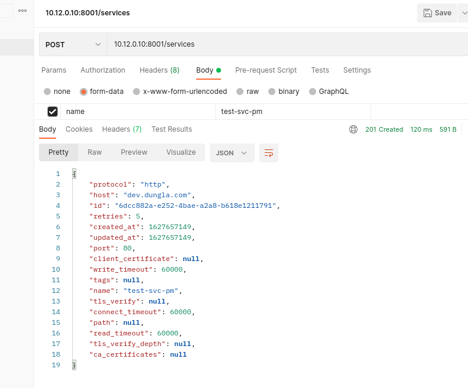

# Expose Service with Kong Gateway

## What are Services and Route
- Service and Route chỉ ra cách đưa services tới client thông qua Kong Gateway. Khi cấu hình truy cập API của ta, ta sẽ start một services. Services đại diện cho một upstream api or microservice.
- Trước khi request tới một service, ta cần add một route liên kết với services. Route xác định cách request đi tới Serivce sau khi request từ client match với route đó khi tới Kong Gateway. Một Service có thể có nhiều Route.
- Sau khi cấu hình Services và Route, ta có thể bắt đầu thực hiện request tới Kong.

# Services
- Đại diện cho từng upstream.
- Thuộc tính chính của một Services chính là URL của nó (nơi Kong sẽ uỷ quền lưu lượng truy cập). Ta phải chỉ định "protocol", "host" , "port" và "path".
- Service được liên kết với Route. Route là điểm ngoài cùng của Kong định nghĩa các rule match với client request. Một khi Route match, Kong sẽ chuyển tới Services mà được liên kết với nó. Chi tiết về cách [Kong proxies traffic](https://docs.konghq.com/gateway-oss/2.5.x/proxy/) 

*Hình ảnh mô tả luồng request và response được route qua service tới backend api*


## Add Services
*Để dễ hình dung, ở đây tôi dùng 2 cách khác nhau là sử dụng konga và Admin API để tạo services*
| Konga | Admin API |
|--------------|-------|
|  |  |

- Trong đó:

  - ```name```: Services name
  - ```retries```: số lần thử khi Kong không gọi tới được server upstream. Default: 5
  - ```protocol```: Giao thức sử dụng để giao tiếp với upstream("grpc", "grpcs", "http", "https", "tcp", "tls", "udp"). Default: "http"
  - ```host```: tên của upstream server hoặc tên(địa chị IP) của backend service.
  - ```ports```: Port của upstream server.
  - ```path```: path sư dụng để request xuống upstream. Default: "blank path". Có thể sử dụng để thay đổi root path xuống upstream
  - ```connect_timeout```: thời gian chờ để kết nối tới upstream (ms). Default: 60000
  - ```write_timeout```: Thời gian giữa chờ giữa 2 thao tác write liên tiếp để chuyển request tới upstream. Default: 60000ms
  - ```read_timeout```: Thời gian giữa chờ giữa 2 thao tác read liên tiếp để chuyển request tới upstream. Default: 60000ms
  - ```tags```: sử dụng cho việc group và filter.
  
  **Tham khảo thêm các tham số khác [tại đây](https://docs.konghq.com/gateway-oss/2.5.x/admin-api/#service-object)**

  
  