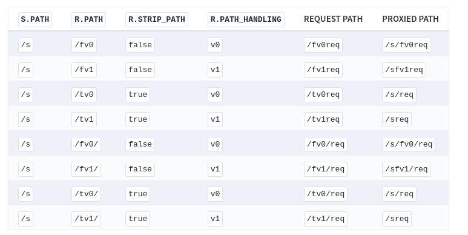
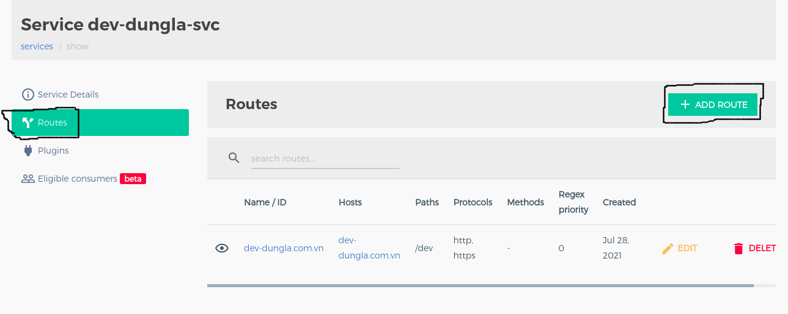

# Routes
  
  - Bạn cần tối thiếu 1 matching rules áp dụng cho từng loại protocol. Tùy thuộc vào cấu hình protocol để phù hợp với Route (được xác đinh trong trường ```protocol```), điều này có nghĩa là ít nhất một trong các thuộc tính sau phải được đặt
    - For ```http```: methods, hosts, headers or paths.
    - For ```https```: methods, hosts, headers, paths or snis; 
    - For ```tcp```: sources or destinations;
    - For ```tls```: sources, destinations or snis;
    - For ```grpc```: hosts, headers or paths;
    - For ```grpcs```: hosts, headers, paths or snis
  **Path handling algorithms**
  - ```"v0"```: được sử dụng trong Kong 0.x và 2.x. Nó xử lý ```service.path```, ```route.path```và ```request path``` như một ```segment``` của URL. Nó sẽ luôn tham gia sau dấu ```/```. Ví dụ, có service path ```/s```, route path ````/r```, request path ```/re```, path được nối sẽ là ```/s/re```. Nếu kết quả của path là 1 dấu ```/```, sẽ không có sự chuyển đổi nào đươc thực hiên với nó. Nếu dài hơn thì dấu ```/``` sau sẽ bị xóa.

  - ```"v1"```: được sử dụng trong Kong 1.x. Nó xử lý ```service.path``` như một ```prefix``` của URL, bỏ qua những dấu ```/``` ban đầu của request path và route path. Ví dụ, service path ```/s```, route path ```/r``` và request path ```/re```, path sau khi kết hợp lại là ```/sre```.
  - Cả 2 thuật toán đều phát hiện các "dấu / kép" khi kết hợp path và thay thế chungs bằng bằng 1 dấu ```/```.
  *Tổng kết*

  

## Add route
- Để tạo route ứng với service tương ứng, trên konga chọn Services cần add route, chọn Route -> Add route

  

- Add route:
 

**Trong đó**
- ```name```: tên của route
- ```protocol```: Các giao thức mà Route cho phép. Default: http, https
- ```method```: Các HTTP method khớp với Route
- ```hosts```: List các domain khớp với Route
- ```paths```: List các path sẽ match với Route.
- ```headers```: 
- ```https_redirect_status_code```: Khi muốn chuyển hướng tất cả các request HTTP match với Route sang HTTPS, đặt thành 301. Default: 426 <!--(To instruct Kong to redirect all HTTP requests matching this Ingress rule to HTTPS, update its annotations to limit its protocols to HTTPS only and issue a 301 redirect:) -->
- ```regex_priority```: A number used to choose which route resolves a given request when several routes match it using regexes simultaneously. When two routes match the path and have the same regex_priority, the older one (lowest created_at) is used. Note that the priority for non-regex routes is different (longer non-regex routes are matched before shorter ones). Default: 0
- ```strip.path```: Tuân theo bảng route ở trên. Default: true
- ```path_handing```: Kiểm soát cách r.path, s.path và request path kết hợp với nhau khi chuyển request xuống proxy. Default "v0". (trong Konga default là "v1")
- ```preserve_host```: When matching a Route via one of the hosts domain names, use the request Host header in the upstream request headers. By default set to false, and the upstream Host header will be that of the Service's host (Dùng khi sử dụng ingress trong k8s)
- ```request_buffering```
- ```response_buffering```
- ```snis```: A list of SNIs that match this Route when using stream routing.
- ```sources```: A list of IP sources of incoming connections that match this Route when using stream routing. Each entry is an object with fields “ip” (optionally in CIDR range notation) and/or “port”.
- ```destinations```: A list of IP destinations of incoming connections that match this Route when using stream routing. Each entry is an object with fields “ip” (optionally in CIDR range notation) and/or “port”.
- ```tags```: sử dụng cho mục đích groups và filter.
- ```service```: ID/name của service mà Route kết hợp.

  # Tham khảo
  - https://www.contentstack.com/docs/developers/create-content-types/understand-default-url-pattern/ 
  - https://processwire.com/docs/front-end/how-to-use-url-segments/ 
  - https://docs.konghq.com/gateway-oss/2.5.x/admin-api/#route-object