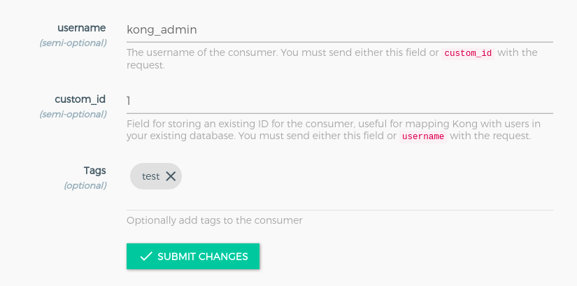

# Consumer
- Consumer đại diện cho 1 user của services, nó có thể control được ai được phép access vào API. 



- Cấu trúc của consumer đơn giản bao gồm 3 trường:
  - ```username```: Tên duy nhất của Consumer.
  - ```custom_id```: ID của consumer.
  - ```tags```: sử dụng để groups hoặc filter

# Plugin
- Là cách mà ta có thể thêm tính năng cho Services chạy trong Kong như: Authentication, Rate limiting... Khí thêm cấu hình plugin cho Service, mọi request của client đối với Serivces đó sẽ chạy plugin đó. Nếu plugin cần được điều chỉnh theo các giá trị khác nhau cho một số cumsumer, ta có thể tạo các plugin riêng biệt cho cả Service và Consumer, thông qua ```field``` service và consumer.
- Một số plugin được hỗ trợ bởi Kong phiên bản open source:
  - Authentication: Basic authentication, HMAC authentication, JWT, Key Authentications, LDAP authentication, OAuth2.0, Session
  - Security: ACME, Bot Detection, CORS, IP Restriction
  - Trafic Control: ACL, Proxy cache, Rate limiting,....
  - Serverless: AWS Lambda, Azure function
  - Analytics & Monitoring: Prometheus, Datalog,...
  - TRANSFORMATIONS: Request tranformer, response transformer
  - Logging: HTTP log, TCP log, Syslog,...
- Các plugin hỗ trợ cho các phiên bản có thể tham khảo thêm tại [đây](https://docs.konghq.com/hub/)