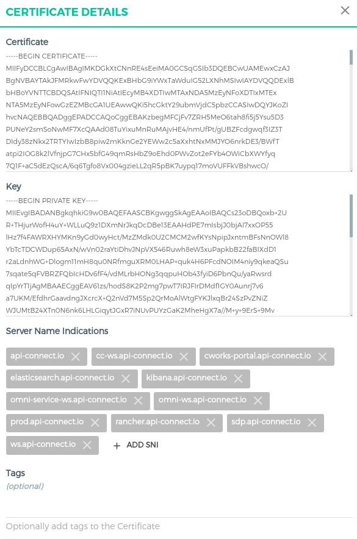

# Certificate
- Đại diện cho một public certificate, dùng để xử lý các request được mã hóa SSL/TLS hoặc để sử dụng như một trust CA tin cậy khi xác thực peer certificate of client/service.
- Được liên kết với SNI để liên kết 1 cặp cert/key cho 1 hoặc nhiều hostname.
- Nếu các chứng chỉ trung gian được yêu cầu ngoài chứng chỉ chính, chúng phải được nối với nhau thành một chuỗi theo thứ tự sau: chứng chỉ chính ở trên cùng, tiếp theo là bất kỳ chứng chỉ trung gian nào.
Ví dụ:


Trong đó:
- ```cert```: Chuỗi chứng chỉ công khai được mã hóa PEM của cặp khóa SSL.
- ```key```: PEM-encoded private key of the SSL key pair.
- ```snis```: list các domain được liên kết với certificate.