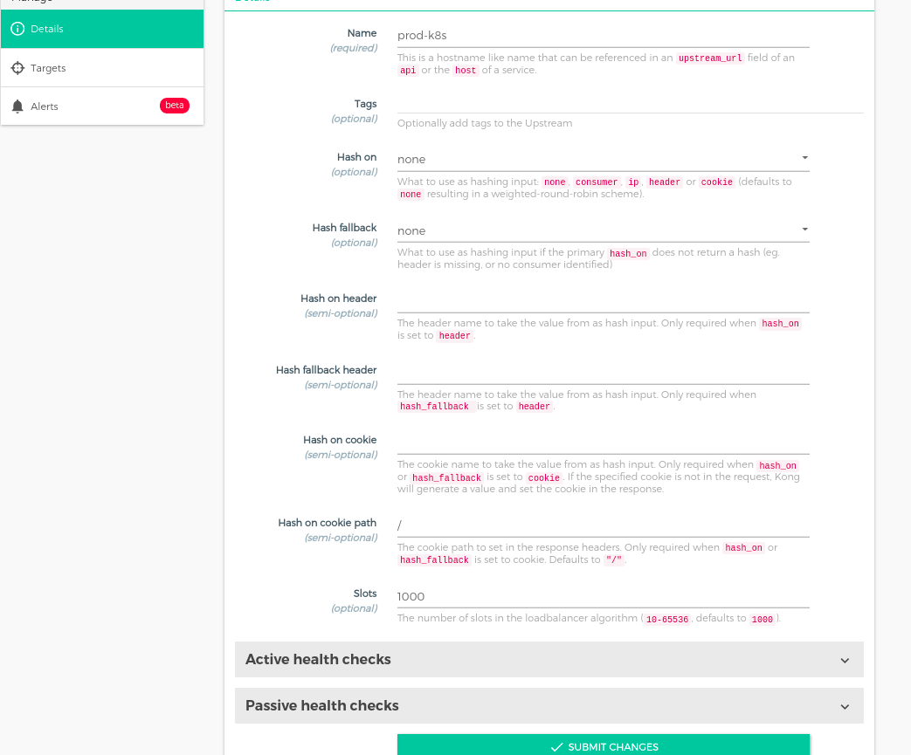
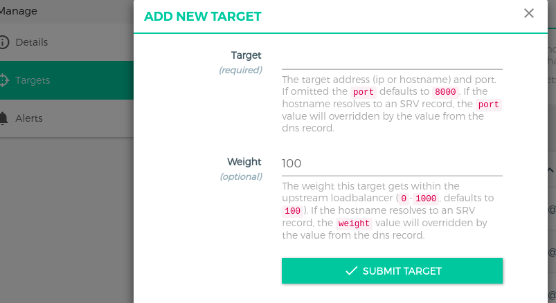

# Upstream
- Được sử dụng để LB các request đến multi target.
- Bao gồm cơ chế health checker, có thể enable hoặc disable dựa trên khả năng phục vụ của target đối với các request.
# Add upstream



*Trong đó:*
  - ```name```: hostname, phải trùng với ```hosts``` của services.
  - algorithm: thuật toán cân bằng tải ("consistent-hashing", "least-connections", "round-robin". Default: "round-robin")
  - slots: The number of slots in the load balancer algorithm. If algorithm is set to round-robin, this setting determines the maximum number of slots. If algorithm is set to consistent-hashing, this setting determines the actual number of slots in the algorithm. Accepts an integer in the range 10-65536. Default: 10000.
  - healthchecks.active.concurrency: số lượng kiểm tra đồng thời, default:10
  - healthchecks.active.healthy.successes: số lần check success healthchecks.active.healthy.http_statuses để cân nhắc healthy.
  - healthchecks.active.healthy.http_statuses: HTTP status code để cân nhắc là healthy. Default: 200, 302
  - healthchecks.active.healthy.interval: Khoảng cách giữa 2 lần check active healthy.
  - healthchecks.active.unhealthy.interval: ngược lại với healthchecks.active.healthy.interval
  - healthchecks.active.unhealthy.http_statuses: List http satatus code để chỉ ra target unhealthy
  - healthchecks.active.unhealthy.tcp_failures:
  - healthchecks.active.unhealthy.timeouts:

*Tham khảo thêm về các parameter [tại đây](https://docs.konghq.com/gateway-oss/2.5.x/admin-api/#upstream-object)*


# Target
- Là 1 IP address/hostname + Port  để xác định ra một backend service. Mỗi upstream có thể có nhiều target.
Ví dụ:
