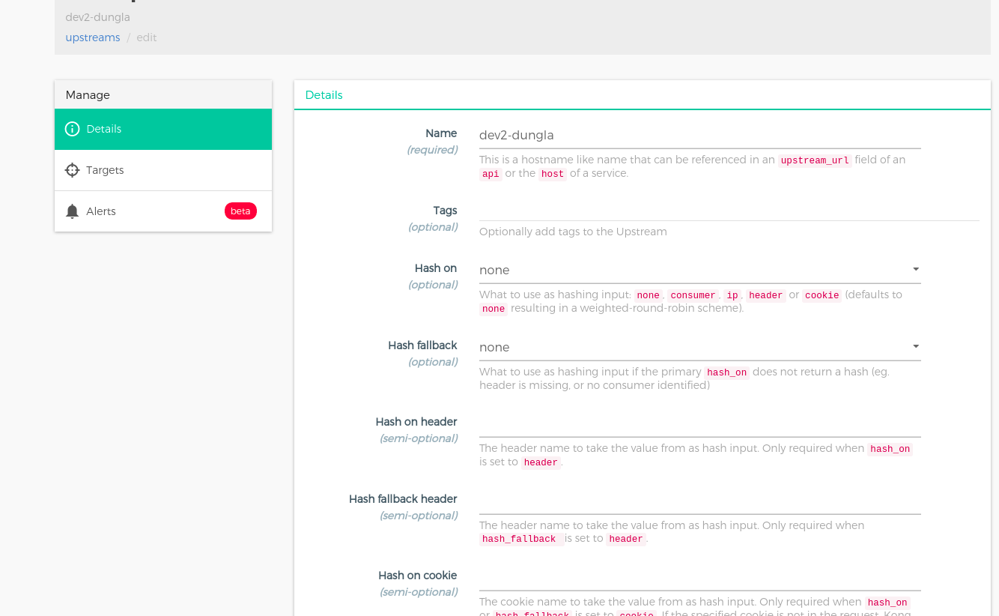
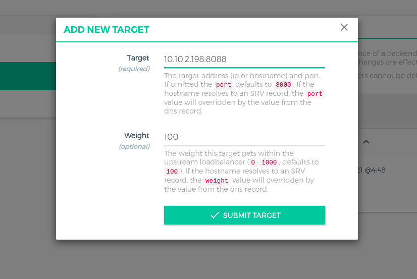
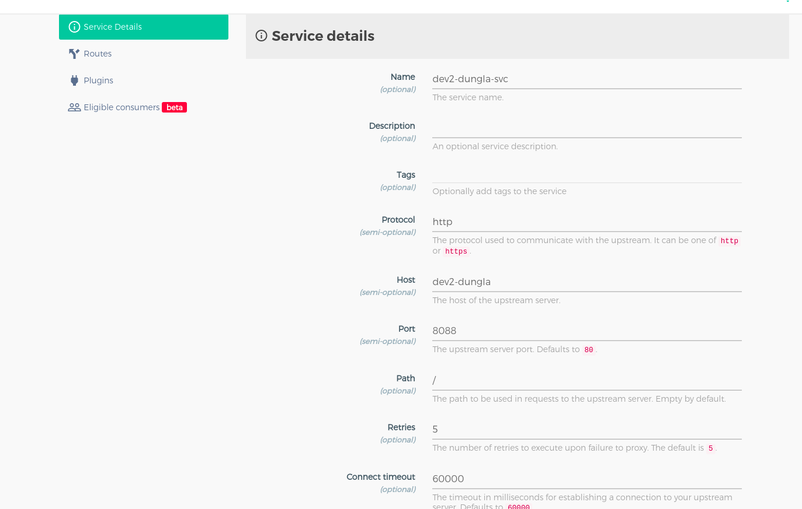
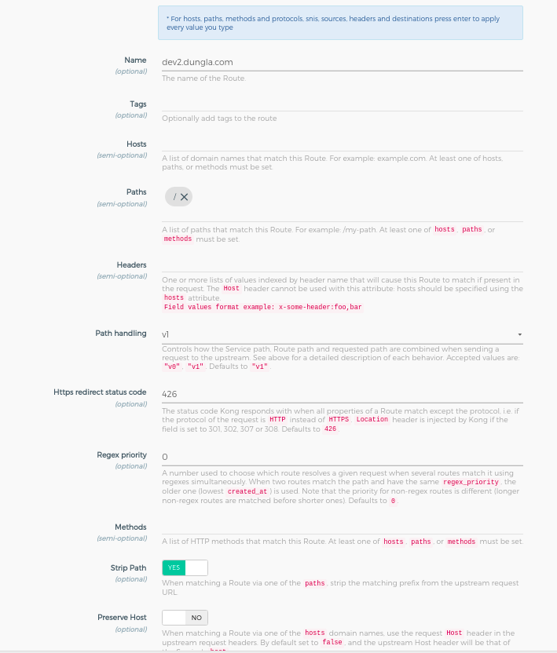
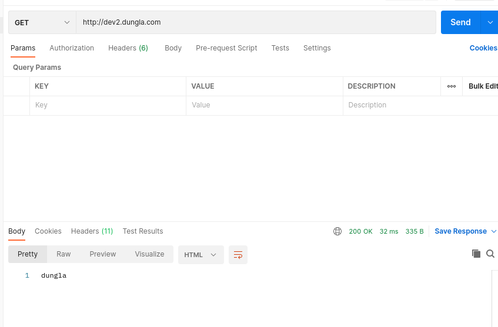
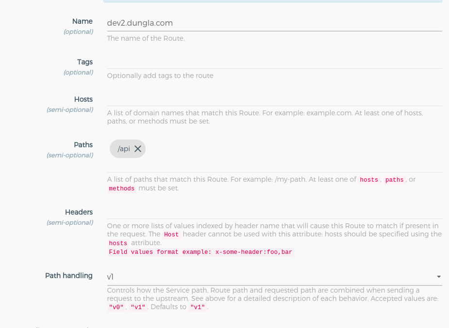
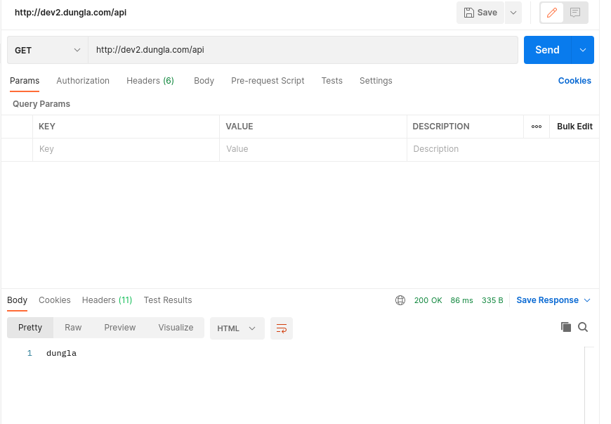
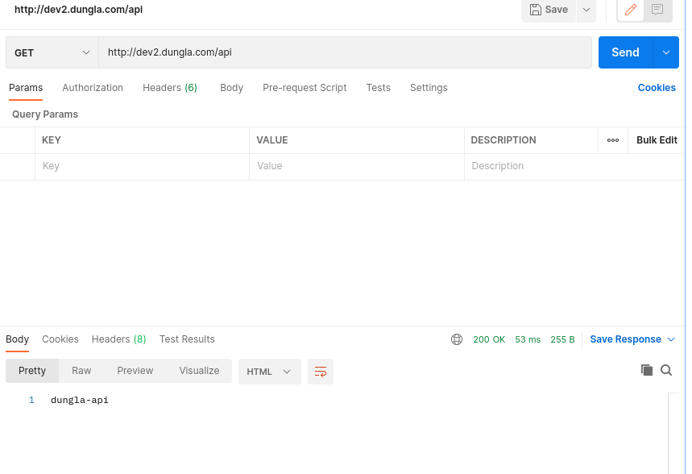

# demo cơ bản khi sử dụng Kong gateway
- Thiết lập Kong API Gateway để cân bằng tải và điều hướng Requests
**Create Upstream**
- Khi tạo một upstream, chúng ta sẽ thấy có rất nhiều thứ chúng ta có thể config trên popup như Active health checks, Passive health checks, rồi tùy chỉnh http code được xem là healthy/unhealthy. Để đơn giản do ở đây có 1 target nên sẽ không set health check.



**Add target**
- Sau khi tạo xong một upstream, chúng ta bắt đầu set Targets cho nó. Targets chính là đích mà các cái Upstream của ta hướng tới, bản chất nó chính là địa chỉ của các server chứa services



**Create service**



Lưu ý: hosts của service phải trùng với tên của upstream

**Add route**
- Sau khi tạo service, chúng ta sẽ thêm các Routes để điều hướng các request tới chính xác các API trong service này.
- Ta vào xem detail của Services --> Routes --> ADD ROUTES



## Kiểm tra kết quả:
- kết quả thu được sẽ là kết quả khi gọi tới: http://10.10.2.198:8088/ (target)



# Demo Strip.path trong Route
- Khái niệm về strip.path đã được trình bày ở [đây](https://github.com/ladung/KONG/blob/main/docx/3.route_object.md)
- Ta sẽ sửa lại tham số ```path``` khi cấu hình route như sau



- Trường hợp nếu enable strip.path, kết quả thu được sẽ là kết quả khi gọi tới: http://10.10.2.198:8088/



- Trường hợp nếu disable strip.path, kết quả thu được sẽ là kết quả khi gọi tới: http://10.10.2.198:8088/api

