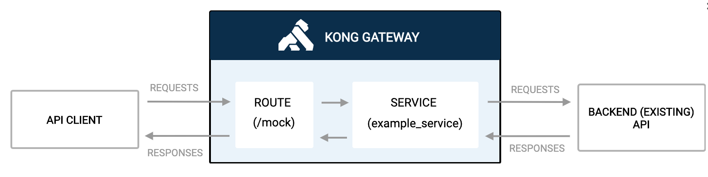
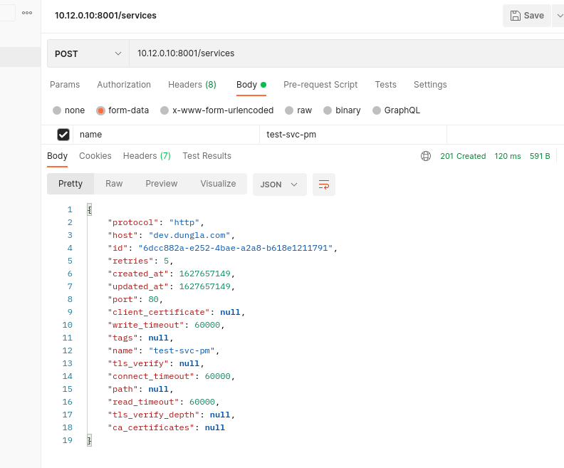
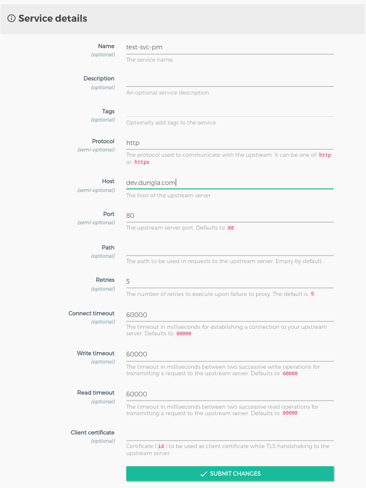

# Expose Service with Kong Gateway

## What are Services and Route
- Service and Route chỉ ra cách đưa services tới client thông qua Kong Gateway. Khi cấu hình truy cập API của ta, ta sẽ start một services. Services đại diện cho một upstream api or microservice.
- Trước khi request tới một service, ta cần add một route. Route xác định cách request đi tới Serivce sau khi chúng tới Kong Gateway. Một Service có thể có nhiều Route.
- Sau khi cấu hình Services và Route, ta có thể bắt đầu thực hiện request tới Kong.

*Hình ảnh mô tả luồng request và response được route qua service tới backend api*

## Add Services
         

